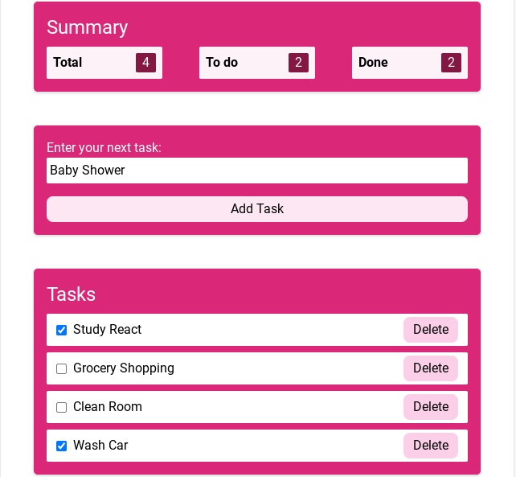

# To Do List App

## Project Introduction

Welcome to the To Do List App, a practical tool designed to help you organize your tasks and stay productive. This project is your personal assistant for keeping track of your to-do list efficiently.




## Technologies Used

Here are the technologies, libraries, and tools that power this project:

- React: A popular JavaScript library for building user interfaces.
- Tailwind CSS: A utility-first CSS framework for rapid UI development.
- Vite: A fast and versatile build tool for web development.
- TypeScript: A typed superset of JavaScript that enhances code quality and reliability.
- Material-UI: A popular UI framework that provides pre-built React components for creating modern, responsive, and stylish user interfaces.

## Getting Started

To run this project locally, follow these steps:

```bash
# Clone the repository
git clone https://github.com/Ruzeda/toDolistApp.git

# Change to the project directory
cd your-project

# Install dependencies
npm install

# Start the development server
npm run dev

```

## Unsolved Problems
Issue 1: Installing and integrating Tailwind CSS presented a challenging learning curve. At present, I'm encountering three errors related to Tailwind CSS.

 Issue 2: Setting up the development environment proved to be initially complex, as I initially used Create React App.

## Future Enhancements
Task Notes: Allow users to attach notes or additional details to their tasks. This can be helpful for adding context to tasks.

User Authentication: Add user authentication to allow users to create accounts and securely store their to-do lists. This can be helpful for personalization and data persistence.

Recurring Tasks: Implement the ability to create recurring tasks (e.g., daily, weekly, monthly) for repetitive chores or responsibilities.


## Hosted App

You can access the hosted version of this app on [Netlify](https://ruzedatodolistapp.netlify.app/).
